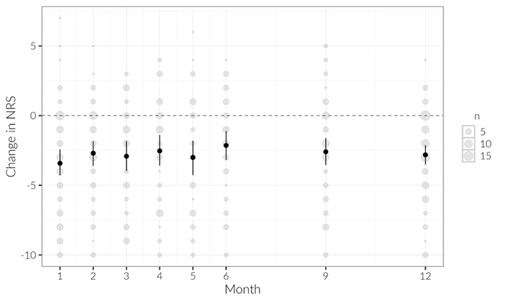

# Red Flag Review – Scenario 1

## Background

Dr. Tekenster was studying the effectiveness of administering an epidural steroid injection to treat chronic lower back pain. Patients receiving the injection at his clinic were invited to participate in a prospective follow-up study.

At baseline (prior to injection), patients were asked to rate their typical back pain using the Numeric Rating Scale (NRS), a 0–10 scale where higher scores indicate worse pain.

After receiving the injection, patients were contacted monthly for 6 months and again at 9 and 12 months to report their current pain level using the same scale.

A total of 124 patients were enrolled at baseline. Follow-up sample sizes decreased over time, with 124 patients responding at month 1 and 81 patients responding at month 12.

## Statistical Approach

For each follow-up time point, the team calculated the change in pain score as:

(baseline NRS – follow-up NRS)

At each month, they conducted a Wilcoxon signed-rank test comparing baseline pain scores to pain scores at that specific follow-up month.

Separate hypothesis tests were performed for each time point.

## Findings

Mean pain scores decreased at every follow-up time point compared to baseline. The average reduction ranged from 1.8 to 2.6 points across months.

All Wilcoxon signed-rank tests were statistically significant (all p-values < 0.0001).

Dr. Tekenster and his team concluded that epidural steroid injections were effective in significantly reducing back pain for up to 12 months following treatment.

Figure. Mean change in NRS score at each time point, with 95% confidence intervals.

