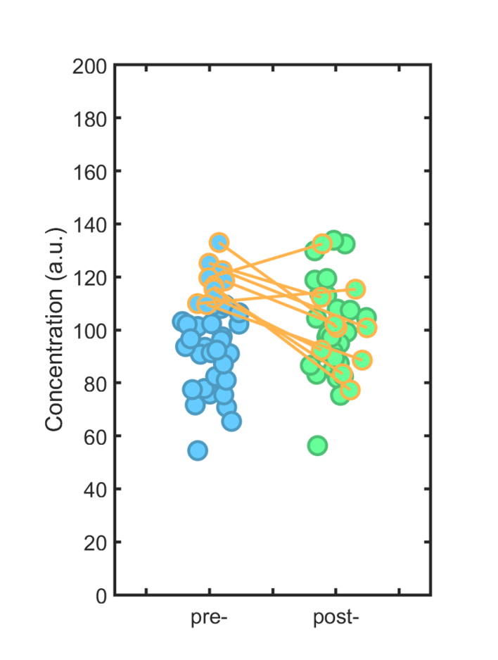

# Red Flag Review – Scenario 4

## Background

Investigators were studying whether a new treatment drug reduced circulating immune cell concentration. Immune cell concentration (measured in arbitrary units) was assessed in the blood of 40 individuals prior to treatment.

All participants then received the treatment drug. Immune cell concentration was measured again two weeks later.

The investigators were particularly interested in individuals with elevated immune cell concentrations at baseline. Therefore, they restricted their primary analysis to the 25% of participants with the highest immune cell concentrations at baseline (n = 10 individuals).

## Statistical Approach

Within this subgroup (top 25% at baseline), the investigators calculated the change in immune cell concentration (post-treatment minus baseline).

They conducted a paired t-test comparing baseline and post-treatment concentrations among these 10 individuals.

## Findings

Among the 10 individuals in the highest quartile at baseline, mean immune cell concentration decreased substantially following treatment. The paired t-test indicated that this reduction was statistically significant (p = 0.006).

The authors concluded that the treatment drug significantly reduces immune cell concentration among individuals with elevated baseline levels.

Figure. Immune cell concentration before and after treatment among individuals in the highest quartile at baseline.

