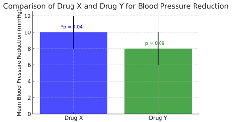

# Red Flag Review – Scenario 7

## Background

Dr. Martine conducted a randomized controlled trial to compare the effectiveness of two antihypertensive medications, Drug X and Drug Y, in reducing systolic blood pressure over one month.

Participants with mild hypertension were randomized 1:1 to receive either Drug X or Drug Y. The primary outcome was change in systolic blood pressure (mmHg) from baseline to 1 month.

A total of 60 participants were enrolled, with 30 assigned to each treatment group.

## Statistical Approach

Within each treatment group, Dr. Martine conducted a paired t-test to assess whether mean blood pressure at 1 month differed from baseline.

## Findings

Participants assigned to Drug X experienced a mean reduction of 10 mmHg (p = 0.04).

Participants assigned to Drug Y experienced a mean reduction of 8 mmHg (p = 0.09).

Dr. Martine concluded that Drug X was effective in reducing blood pressure, whereas Drug Y was not effective.

Figure. Mean blood pressure reduction by drug type, with 95% confidence intervals.

