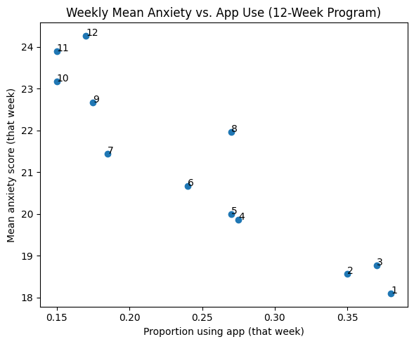

# Red Flag Review – Scenario 8

## Background

Dr. Shah studied whether a stress-reduction app lowers weekly anxiety among medical residents.

Residents were followed for 12 weeks, begining at the start of their residency program. Each week they reported:

- Whether they used the app that week (yes/no)
- Their anxiety score (0–50 scale)

Residents were free to start or stop using the app at any time.

## Statistical Approach

Dr. Shah fit a linear regression model with app use in week t as the independent variable and anxiety in week t as the dependent variable.

## Findings

App use was associated with 4-point lower anxiety scores (p = 0.02).

Dr. Shah concluded that the stress-reduction app effectively lowers anxiety.

To illustrate this finding, they computed the mean anxiety score across all individuals, and the proportion of individuals using the app, for each of the 12 weeks.

Figure. Mean anxiety scores and proportion using the app, labelled by week (1-12).

