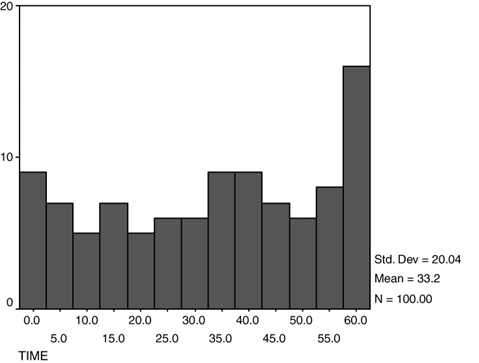

# Practice Consultation 1  Commercial Viewership

## Opening Statement

I’m in a research group that collaborates with First 5 LA, an organization that promotes health in the first 5 years of life. We have been working on a new advertisement targeted at parents of children under age 5 that will run on television. One of the requirements given to us by First 5 LA is that, of people watching television, over 10% must watch the entire advertisement.  
To check this out we had 100 people watch a television show that included our advertisement and we timed how long they paid attention to it when it came on. The average time that the people watched the advertisement was 33 seconds, the standard deviation was 20 seconds, and 13 people watched the entire advertisement. Since 13/100 people watched the entire advertisement, we know the 10% minimum requirement is met.  
Now First 5 LA also wants to know how far into the advertisement 75% of the people are still watching. We have some analysis that showed us the mean minutes watched was 33.2, plus-or-minus 20.04 minutes.  
How can we work this out? Are we able to do it in this meeting?  

## Debriefing

### Population

Intended: Parents who watch television and have children under the age of 5 years.  
Actual: 100 people.  

1. <u>Where did these people come from?</u> They were selected from a database of 100 volunteers.
2. <u>Did these participants have children?</u> There was no determination of whether the 100 participants had children. *The statement read that First 5 wanted to target parents of children under the age of 5. If the sample consists of people that are not a part of this target population, then the conclusions reached may not be meaningful.*
3. <u>Are these people representative of those who watch the show targeted by the ad?</u> These people may be different in terms of employment status, age, enjoyment from watching television, etc. - but we aren't concerned with this; we just want a number to put in our report.

### Intervention

Participants watched a television show and were timed when the advertisement was shown to see how long they were paying attention.

4. <u>When will this advertisement be aired?</u> To be determined, but probably during prime time television in Los Angeles.
5. <u>Did participants know what the intervention was for?</u> The participants thought they were participating in a study to watch and comment on a new television show. *If participants knew that their attention was being tracked, then they might try harder to pay attention (see: Hawthorne Effect).*

### Comparison

NA (descriptive)

### Outcome

The time in the advertisement at which 75% of adults are still watching.

6. <u>How long is the advertisement?</u> 60 seconds long.
7. <u>Do you have this data with you?</u> No, but we have a histogram.
8. <u>Can we see this histogram?</u> Yes. 
9. <u>How many people watched the whole show?</u> The last column of the histogram shows that 16 people watched the ad for more than 57.5 seconds. We know that 13 of these watched for the entire 60 seconds.
10. <u>How do you determine when someone is no longer watching?</u> There is a standard methodology for determining this based on body and eye movements. It is an accepted standard in the industry. *This relates to study validity. If there is no standard methodology to determine this, then the outcome could rely on subjective assessments and the data would then be at risk for bias.*

### Time

NA (cross-sectional)

### Thoughts

The histogram shows the times at which individuals stop watching the program. The area under the histogram is the cumulative number of people that have stopped watching.  

However, the number of people still watching at any given time is 1-pnonwatching. Therefore, if we want to calculate the time at which 75% of people are still watching, this would be equivalent to the time at which 25% of people have stopped watching. We could use the provided histogram to find the value of the 25th percentile.