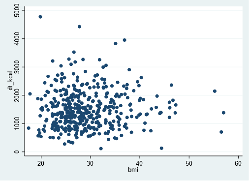

# Data Cleaning Exercise

## 1. Outlier in MVPA

Somebody has a daily MVPA value of 1352.215, which equates to roughly 22.5 hours of moderate to vigorous physical activity per day, over the past 7 days. This value is *highly* suspect.

```
. sum daily_mvpa, d

                         daily_mvpa
-------------------------------------------------------------
      Percentiles      Smallest
 1%     2.083333       .6666667
 5%          5.8              1
10%          7.9            1.5       Obs                 526
25%         13.3            1.5       Sum of Wgt.         526

50%     22.96429                      Mean           29.78098
                        Largest       Std. Dev.      60.75801
75%     37.33333       99.85714
90%     53.58333       107.0714       Variance       3691.536
95%        64.25          133.7       Skewness       19.68991
99%     92.16666       1352.215       Kurtosis       428.3505
```


## 2. Calorie Consumption

There are some individuals that have very low values of calorie consumption. It is highly unlikely that anybody could routinely consume fewer than 500 calories per day. Upon further examination, this includes individuals who are classified as overweight (BMI > 25) and obese (BMI > 30).



## 3. Missingness

This data set contains many missing values. Of the 615 observations, 473 are missing self-reported physical activity, 3 are missing BMI, 202 are missing calorie information, 90 are missing accelerometer data, and 522 are missing Arizona physical activity data.

## 4. Variable Concordance

There is little concordance between the Arizona PA values and the actual accelerometer values. The correlation is quite low (r=0.13) and we can see some cases where the MET values are quite high for the actual amount of MVPA achieved. There does not need to be perfect concordance between these measures as they capture different aspects of PA, but the very low correlation raises suspicion.


The concordance between self-reported PA and accelerometer PA is even more disconcerting. It looks like there is almost no relationship between the two.

## 5. Macronutrients

Seemingly the percent of dietary intake due to macronutrients can be computed as 100% = (percent fat) + (percent protein) + (percent carbohydrates). However, when computing the percent of each macronutrient as (macronutrient grams)(multiplier)/(total calories), the values do not add up to 100%.  

One individual seems to get 100% of their calories from fat, which is highly unlikely.